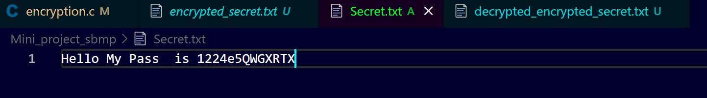
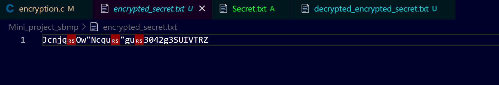
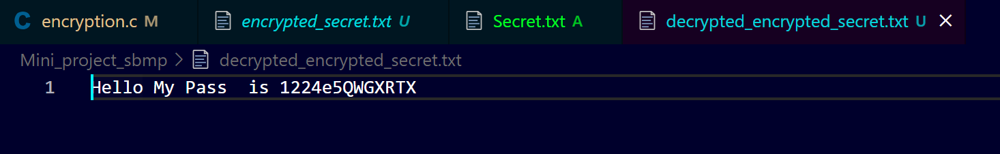
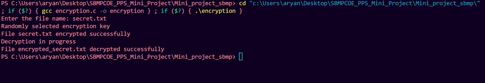

# File Encryption and Decryption System

## Overview
This project is a simple file encryption and decryption system that demonstrates the implementation of different encryption algorithms. It takes an input text file, applies an encryption algorithm to it, and saves the encrypted file. The program can also decrypt the encrypted file using the corresponding decryption algorithm. 

## Algorithms Used
The project implements four different encryption algorithms:

1. **Algorithm 1:** Encrypts by alternating addition and subtraction of 3 to the ASCII values of characters based on their position (even or odd).
2. **Algorithm 2:** Encrypts by alternating addition and subtraction of 6 to the ASCII values.
3. **Algorithm 3:** Encrypts by alternating addition and subtraction of 2 to the ASCII values.
4. **Algorithm 4:** Encrypts by alternating addition and subtraction of 5 to the ASCII values.

Each algorithm can be used for both encryption and decryption processes.

## How It Works
1. The user provides an input file name.
2. The system randomly selects one of the four encryption algorithms.
3. The program reads the file line by line, applies the selected encryption algorithm, and creates an encrypted version of the file.
4. It then reads the encrypted file, applies the corresponding decryption algorithm, and creates a decrypted version of the file.
5. The original, encrypted, and decrypted files are saved with different filenames, allowing users to compare them.

### Example Workflow:
- **Input:** Original file (e.g., `example.txt`)
- **Encryption:** Encrypted file (e.g., `encrypted_example.txt`)
- **Decryption:** Decrypted file (e.g., `decrypted_example.txt`)

## Features
- Random selection of encryption algorithm for added variety.
- Preserves the format of the original file, including newline characters.
- User-friendly interface that guides users through the process.

## Usage
To use the system:
1. Compile the code using a C compiler.
2. Run the program and provide the file name when prompted.
3. The system will automatically encrypt the file and then decrypt it, storing the encrypted and decrypted versions separately.

## Screenshots

**Original File (example.txt):**

**Encrypted File (encrypted_example.txt):**

**Decrypted File (decrypted_example.txt):**

**Screenshot of Console:**

## Contributions
- **BC05 Jaideep Singh:** Developed the basic logic for the code, added the first encryption and decryption algorithm, and implemented the encryption and decryption functions.
- **BC26 Aryan Upadhyay:** Added the 2nd, 3rd, and 4th encryption and decryption algorithms, and fixed some typos.
- **BC02 Paawan Dabhi:** Enhanced the user interface and fixed additional typos.
